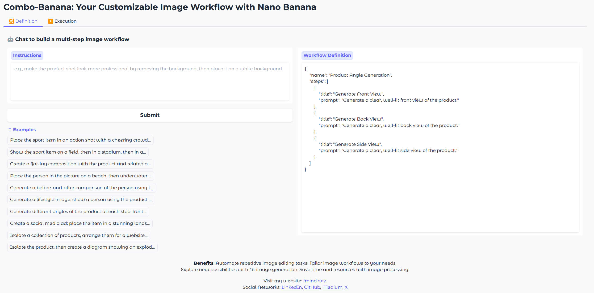
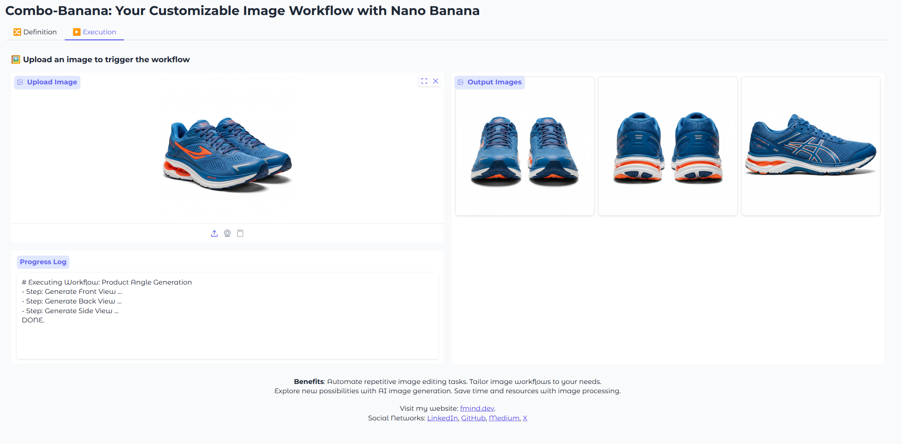

# 🎨 Combo-Banana: Your Customizable Image Workflow

[](https://opensource.org/licenses/MIT)
[](https://www.python.org/downloads/)

**Combo-Banana** is a powerful and intuitive application that allows you to define and execute custom multi-step image processing workflows using natural language.

Powered by [Google's Nano Banana](https://blog.google/products/gemini/updated-image-editing-model/), it transforms your textual instructions into a sequence of image manipulation tasks and runs them for you.

## ✨ Benefits

- **Automate Repetitive Tasks:** Streamline your image editing process by automating recurring tasks.
- **Save Time and Resources:** Significantly reduce the time and effort required for complex image processing.
- **Explore AI Creativity:** Leverage the power of generative AI to discover new and exciting image styles and effects.
- **Tailor-Made Workflows:** Create workflows that are perfectly suited to your specific creative or professional needs.

## Examples

Below are screenshots illustrating the two main steps of using the application:

1. **Workflow Definition:** Use natural language to define a series of image editing steps. The application will convert your input into a structured workflow.

    

2. **Workflow Execution:** Upload an image, and the application will execute the defined workflow, showing the results for each step.

    

## 🚀 Getting Started

These instructions will get you a copy of the project up and running on your local machine for development and testing purposes.

### Prerequisites

- Python 3.13+
- [uv](https://github.com/astral-sh/uv) (a fast Python package installer and resolver)
- [just](https://github.com/casey/just) (a handy command runner for automating tasks)

### Installation

1. **Clone the repository:**

    ```bash
    git clone https://github.com/fmind/combo-banana.git
    cd combo-banana
    ```

2. **Install the dependencies:**
    Use the `just` command to install all required packages.

    ```bash
    uv sync
    ```

### Running the Application

Once the installation is complete, you can start the Gradio web interface:

```bash
just app
```

Open your web browser and navigate to the URL provided in the console (usually `http://127.0.0.1:7860`).

## 🛠️ Development

This project uses `just` to simplify common development tasks.

- **Check Code Quality:**

    ```bash
    just check
    ```

    This will run linting, formatting checks, type checking, and unit tests.

- **Format Code:**

    ```bash
    just format
    ```

    This will automatically format the code to match the project's style.

- **Clean Up:**

    ```bash
    just clean
    ```

    This will remove temporary files and caches.

## 🐳 Docker

You can also build and run the application using Docker.

1. **Build the Docker image:**

    ```bash
    just docker-build
    ```

2. **Run the Docker container:**

    ```bash
    just docker-run
    ```

    This will start the application on port 8080.

## 📄 License

This project is licensed under the MIT License - see the [LICENSE.txt](LICENSE.txt) file for details.
